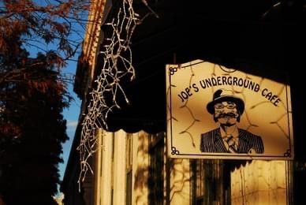

# My simple website using markdown

Welcome to my simple **website**. I have used only markdown with this site.

## About me

I'm a student but in the *early days* I've done various things such as:

> I studied to be a riding instructor. I never worked in this field.
>
> After graduating I took care of horses in a trotting stable until I injured from knee.
>
> Then I decided to go to high school and started working in a post office.
>
> I got bored and left to United States for a year to be an ***au pair***. I had great time exploring the country.
>
> I worked in a travelling office and continued my high school studies when I came back.
>
> Then I worked as a cleaner in a hospital department of oncology - _sad years and lost a lot of people who I got to know_.
>
> While working as a cleaner, had a vision to become a typist - _got the job_. Then started to work in the ER as a medical typist and transferred to a private company a year later. I still work there as a part time typist.

### My travels

I have had great travels:

- As a child
    - Crete
    - Cypros
    - Tunisia
    - Mallorca
    - Bulgaria
- As an adult
    - USA (_one year here_)
        - North Carolina
        - South Carolina
        - Georgia
        - New York
        - Florida
    - USA again in 2008 December
        - New York (_a week in NYC before Christmas_)
    - Germany (_one week traveling around with au pair friends from USA_)
        - Munich
        - Nuremberg
        - Frankfurt
        - Berlin
    - UAE (_visiting the one au pair friend who wasn't able to attend trip to Germany_)
        - Dubai
    - Egypt (_in total of 5 months traveling around with rugsag in several trips_)
        - Alexandria
        - Cairo
        - Sharm el Sheikh
        - Hurghada
        - Luxor
        - Dahab
    - Sweden
        - Luleå
        - Stockholm

#### Some photos

_Rhodesian ridgeback jumps_

_Joe's Underground Cafe in Augusta, Georgia. Check it out *[Things to do in Augusta](https://www.visitaugusta.com/listing/joes-underground/268/)*_

Thank you for visiting!

